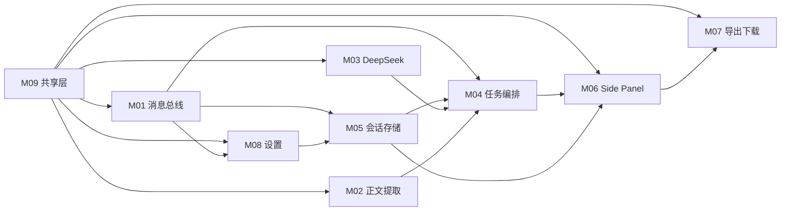

# Chrome 浏览器文章翻译插件 — 功能模块拆分

| 项目 | 说明 |
|------|------|
| 文档版本 | v1.0 |
| 文档类型 | 功能模块说明 |
| 依据文档 | [技术方案.md](./技术方案.md) v1.0、[需求文档.md](./需求文档.md) v1.0 |
| 适用范围 | 模块边界、职责、接口与依赖；**不包含**具体代码实现 |
| 最后更新 | 2026-06-02 |

---

## 1. 模块总览

### 1.1 模块清单

| 模块 ID | 模块名称 | 运行环境 | 目录 | 优先级 |
|---------|----------|----------|------|--------|
| M01 | 扩展基础与消息总线 | Service Worker | `src/background/` | P0 |
| M02 | 正文提取 | Content Script | `src/content/` | P0 |
| M03 | DeepSeek 翻译引擎 | Service Worker（shared 库） | `src/shared/deepseek/` | P0 |
| M04 | 翻译任务编排 | Service Worker | `src/background/` | P0 |
| M05 | 会话与存储 | Service Worker | `src/background/` | P0 |
| M06 | Side Panel 主界面 | Side Panel 页面 | `src/sidepanel/` | P0 |
| M07 | 导出与下载 | Side Panel 页面 | `src/sidepanel/export/` | P0 |
| M08 | 设置管理 | Options 页面 | `src/options/` | P0 |
| M09 | 共享类型与工具 | 多上下文只读引用 | `src/shared/` | P0 |

### 1.2 模块依赖关系



### 1.3 端到端数据流

```mermaid
flowchart TB
    subgraph Input
        DOM[网页 DOM]
        UserCfg[用户配置]
    end

    subgraph Pipeline
        M02 -->|ArticlePayload| M04
        M05 -->|Settings / Session| M04
        M03 -->|TranslatedBlock[]| M04
        M04 -->|TranslationDoc| M05
        M05 -->|TranslationDoc| M06
    end

    subgraph Output
        M06 -->|阅读| UI[译文展示]
        M07 -->|Blob| File[MD / PDF 文件]
    end

    DOM --> M02
    UserCfg --> M08
    M08 --> M05
    M06 --> M07
```

### 1.4 与需求文档映射

| 需求范围 | 负责模块 |
|----------|----------|
| F-001～F-003 全文翻译 | M02 + M03 + M04 |
| F-004 DeepSeek | M03 |
| F-010～F-013 翻译状态 | M04 + M06 |
| F-020～F-022 译文展示 | M06 |
| F-030～F-037 下载 | M07 |
| F-040～F-043 配置 | M08 + M05 |
| F-050～F-053 无历史 | M05 |
| UI-001～UI-004 简约界面 | M06 + M08 |

---

## 2. M01 — 扩展基础与消息总线

### 2.1 模块定位

扩展运行时入口与模块间通信枢纽，负责 Service Worker 生命周期、消息路由、Side Panel 打开行为，不包含业务翻译逻辑。

### 2.2 职责边界

| 负责 | 不负责 |
|------|--------|
| 注册 `chrome.runtime.onMessage` / Port 监听 | 正文 DOM 解析 |
| 按消息类型分发至 M04 / M05 / M08 处理器 | 直接调用 DeepSeek API |
| 工具栏图标点击打开 Side Panel | UI 渲染 |
| 扩展安装/更新时的初始化钩子（可选） | 译文持久化 |

### 2.3 目录与文件

| 文件 | 说明 |
|------|------|
| `src/background/index.ts` | Service Worker 入口，挂载监听器 |
| `src/background/message-router.ts` | 消息类型 → 处理器映射 |

### 2.4 对外接口（消息）

| 消息 | 处理方 | 说明 |
|------|--------|------|
| `TRANSLATE_START` | 转发 → M04 | 启动翻译 |
| `GET_SESSION_STATE` | 转发 → M05 | 查询 tab 会话 |
| `GET_SETTINGS` / `SAVE_SETTINGS` | 转发 → M05 / M08 | 配置读写 |
| `EXTRACT_ARTICLE` | 转发 → M02（跨上下文） | Background 向 Content Script 发消息 |

### 2.5 依赖关系

- **依赖**：M09（消息类型常量、错误码）
- **被依赖**：M04、M05、M06、M08 均通过本模块通信

### 2.6 模块验收

- [ ] 各消息类型能正确路由到对应处理器
- [ ] 未知消息返回明确错误，不静默失败
- [ ] 点击扩展图标可打开 Side Panel

---

## 3. M02 — 正文提取模块

### 3.1 模块定位

在目标网页的隔离环境中识别文章正文，输出结构化 `ArticlePayload`，供翻译流水线使用。

### 3.2 职责边界

| 负责 | 不负责 |
|------|--------|
| Readability 主路径 + 兜底选择器提取 | 调用翻译 API |
| DOM → `ContentBlock[]` 结构化 | 存储译文 |
| 返回标题、语言提示、纯文本摘要 | 修改页面 DOM 展示 |

### 3.3 目录与文件

| 文件 | 说明 |
|------|------|
| `src/content/index.ts` | Content Script 入口，监听 `EXTRACT_ARTICLE` |
| `src/content/extractor.ts` | 提取主流程编排 |
| `src/content/dom-to-blocks.ts` | 节点遍历与块映射 |

### 3.4 输入 / 输出

**输入**

- 当前页面 `document`（`http` / `https`）

**输出 `ArticlePayload`**

| 字段 | 类型 | 说明 |
|------|------|------|
| `url` | string | 页面 URL |
| `title` | string | 原文标题 |
| `byline` | string? | 作者/日期 |
| `langHint` | string? | 页面语言提示 |
| `blocks` | ContentBlock[] | 有序内容块 |
| `plainText` | string | 扁平纯文本 |

**`ContentBlock` 类型**

| 字段 | 说明 |
|------|------|
| `type` | `heading` \| `paragraph` \| `list` \| `blockquote` \| `code` |
| `level` | 标题 1–6 或列表嵌套层级 |
| `text` | 块内文本 |
| `items` | 列表项（`type=list` 时） |

### 3.5 核心策略

1. **主路径**：Readability 定位主内容区 → 映射 h1–h6、p、ul/ol、blockquote、pre
2. **兜底**：`article`、`.post-content`、`main` 等常见选择器
3. **失败**：返回空 `blocks`，由 M04 映射为 `NO_CONTENT` 错误
4. **注入**：推荐按需 `chrome.scripting.executeScript` + `activeTab`

### 3.6 依赖关系

- **依赖**：M09（`ArticlePayload`、`ContentBlock` 类型）；可选 `@mozilla/readability`
- **被依赖**：M04（翻译任务编排）

### 3.7 非功能指标

- 提取耗时目标 < 2s，超时 5s 向上层报错

### 3.8 模块验收

- [ ] 典型博客/文档页能返回非空 `blocks`
- [ ] 标题、段落、列表层级基本保留
- [ ] 无正文页面返回空结构且不抛未捕获异常
- [ ] 不访问或依赖 API Key

---

## 4. M03 — DeepSeek 翻译引擎模块

### 4.1 模块定位

封装 DeepSeek Chat Completions API 的调用、分片、Prompt 构造与响应解析，对上层提供「文章块 → 译文块」的纯函数式能力。

### 4.2 职责边界

| 负责 | 不负责 |
|------|--------|
| HTTP 请求、超时、认证头 | 任务状态机、防重复提交 |
| 长文分片 `planChunks` | UI 进度展示（仅返回进度数据） |
| System/User Prompt 模板 | 正文提取 |
| 响应解析为 `TranslatedBlock[]` | 配置 UI |

### 4.3 目录与文件

| 文件 | 说明 |
|------|------|
| `src/shared/deepseek/client.ts` | fetch 封装、超时、HTTP 错误映射 |
| `src/shared/deepseek/chunker.ts` | 按 ContentBlock 边界分片 |
| `src/shared/deepseek/prompts.ts` | System / User 消息模板 |
| `src/shared/deepseek/parser.ts` | API 响应 → 译文块 |

### 4.4 对外接口（逻辑 API）

| 接口 | 输入 | 输出 |
|------|------|------|
| `translateArticle` | `apiKey`, `blocks`, `targetLang`, `sourceLang`, `onProgress?` | `TranslatedBlock[]` |
| `planChunks` | `blocks`, `maxCharsPerChunk` | `ChunkPlan[]` |
| `mapApiError` | `Response` / `Error` | 内部错误码 |

### 4.5 API 约定

| 项 | 值 |
|----|-----|
| Base URL | `https://api.deepseek.com` |
| 路径 | `POST /v1/chat/completions` |
| 模型 | `deepseek-chat` |
| 认证 | `Authorization: Bearer <API_KEY>` |
| 流式 | v1.0 使用 `stream: false` |

### 4.6 分片策略

| 策略项 | 说明 |
|--------|------|
| 分片单位 | ContentBlock 边界聚合 |
| 大小上限 | 约 6k–8k 字符/片（实现阶段微调） |
| 请求顺序 | v1.0 严格顺序 |
| 失败策略 | 任一分片失败则整体失败 |
| 进度 | 回调 `onProgress(current, total)` |

### 4.7 错误码映射

| 内部码 | 触发条件 | 用户文案（由 M06 展示） |
|--------|----------|-------------------------|
| `AUTH_INVALID` | HTTP 401 | API Key 无效，请检查设置 |
| `QUOTA_EXCEEDED` | 402 / 429 | 配额不足或请求过于频繁 |
| `NETWORK_ERROR` | 5xx / 网络异常 | 网络异常，请稍后重试 |
| `TIMEOUT` | 请求超时 | 翻译超时，可重试 |
| `UNKNOWN` | 其他 | 翻译失败，请重试 |

### 4.8 依赖关系

- **依赖**：M09（类型、常量）
- **被依赖**：M04（任务编排调用）

### 4.9 模块验收

- [ ] 给定 mock 响应能正确解析为译文块
- [ ] 分片不截断单个段落块
- [ ] 401 / 429 / 超时映射到正确错误码
- [ ] 模块内不读写 `chrome.storage`

---

## 5. M04 — 翻译任务编排模块

### 5.1 模块定位

翻译业务的核心编排层：串联正文提取、DeepSeek 翻译、结果合并与会话写入，管理任务状态与防重复提交。

### 5.2 职责边界

| 负责 | 不负责 |
|------|--------|
| `TRANSLATE_START` 全流程编排 | Prompt 细节（委托 M03） |
| `Map<tabId, JobState>` 状态机 | Side Panel DOM 更新 |
| 调用 M02 提取、M03 翻译 | 文件下载 |
| 合并结果为 `TranslationDoc` 写入 M05 | Options 表单 |

### 5.3 目录与文件

| 文件 | 说明 |
|------|------|
| `src/background/translate-job.ts` | 任务启动、执行、完成/失败 |

### 5.4 任务状态机

```
idle → extracting → translating → done
                          ↓
                        error
```

| 状态 | 含义 | 允许操作 |
|------|------|----------|
| `idle` | 无进行中的任务 | 发起翻译 |
| `extracting` | 正在提取正文 | 拒绝重复翻译 |
| `translating` | 正在分片翻译 | 拒绝重复翻译；推送进度 |
| `done` | 翻译成功 | 重新翻译（覆盖会话译文） |
| `error` | 翻译失败 | 重试 |

### 5.5 编排流程

1. 校验 API Key（从 M05 读取）
2. 设置状态 `extracting`，向 M02 请求 `ArticlePayload`
3. 若 `blocks` 为空 → `NO_CONTENT` → `error`
4. 设置状态 `translating`，调用 M03 `translateArticle`
5. 每片完成 → 通知 M06 `TRANSLATE_PROGRESS`
6. 合并 → 构建 `TranslationDoc` → 写入 M05
7. 设置 `done`，通知 M06 `TRANSLATE_SUCCESS`

### 5.6 输入 / 输出

**输入 `TranslateStartParams`**

| 字段 | 说明 |
|------|------|
| `tabId` | 当前标签页 ID |
| `targetLang` | 目标语言 |
| `sourceLang?` | 源语言，默认 auto |

**输出**

- 成功：`TranslationDoc`（经 M05 缓存，并推送 Side Panel）
- 失败：`TranslateError { code, message }`

### 5.7 依赖关系

- **依赖**：M01（消息入口）、M02、M03、M05、M09
- **被依赖**：M06（发起翻译、接收进度/结果）

### 5.8 模块验收

- [ ] 翻译进行中同 tab 重复点击不产生并行任务
- [ ] 空正文不调用 DeepSeek
- [ ] 无 API Key 时拒绝启动并返回明确错误
- [ ] 成功后 `TranslationDoc` 完整可渲染

---

## 6. M05 — 会话与存储模块

### 6.1 模块定位

统一管理持久配置与临时会话数据，落实「不保存翻译历史」原则。

### 6.2 职责边界

| 负责 | 不负责 |
|------|--------|
| `chrome.storage.local` 读写配置 | 翻译 API 调用 |
| Tab 级 `SessionCache`（内存 / session） | 导出文件 |
| `tabs.onRemoved` 清理会话 | Options UI |

| 明确禁止 | |
|----------|--|
| 译文历史列表、URL 时间线、IndexedDB 历史表 | |

### 6.3 目录与文件

| 文件 | 说明 |
|------|------|
| `src/background/session-cache.ts` | Tab 会话缓存 |
| `src/background/settings.ts` | 持久配置读写 |

### 6.4 存储分层

| 存储介质 | 键 / 内容 | 生命周期 |
|----------|-----------|----------|
| `chrome.storage.local` | `apiKey`, `defaultTargetLang`, `sourceLang`, `lastDownloadFormat?` | 长期，用户可清除 |
| 内存 / `chrome.storage.session` | `translationDoc`, `jobState`, `extractedArticle`, `pageUrl` | 浏览器会话；tab 关闭即清理 |

### 6.5 对外接口（逻辑 API）

| 接口 | 说明 |
|------|------|
| `getSettings()` | 返回配置；API Key 掩码或不返回完整值 |
| `saveSettings(partial)` | 部分更新配置 |
| `getSession(tabId)` | 获取 tab 会话 |
| `setSession(tabId, data)` | 更新 tab 会话 |
| `clearSession(tabId)` | tab 关闭或 URL 变更时清理 |

### 6.6 Tab 会话规则

- 以 `tabId` 为键隔离各标签页译文
- Side Panel 打开时 `GET_SESSION_STATE` 恢复当前 tab 状态
- Tab URL 与缓存 URL 不一致 → 清空译文，提示重新翻译
- 监听 `tabs.onRemoved` 删除对应条目

### 6.7 API Key 安全

- 仅存 `storage.local`，不上传自有服务器
- Background 读取后仅用于 M03 请求头
- 不向 Content Script、Side Panel 传递完整 Key

### 6.8 依赖关系

- **依赖**：M09
- **被依赖**：M04、M06、M08

### 6.9 模块验收

- [ ] 配置重启浏览器后仍可读取
- [ ] 关闭 tab 后会话译文不可再通过插件找回
- [ ] `GET_SETTINGS` 不泄露完整 API Key
- [ ] 无「历史记录」相关 storage 键

---

## 7. M06 — Side Panel 主界面模块

### 7.1 模块定位

用户主操作界面：发起翻译、展示进度与译文、跳转设置、触发下载（委托 M07）。

### 7.2 职责边界

| 负责 | 不负责 |
|------|--------|
| 翻译 / 下载主流程 UI | DeepSeek HTTP 请求 |
| 订阅 M04 进度与结果消息 | 正文 DOM 提取 |
| 渲染 `TranslationDoc` | 长期保存 API Key 表单（属 M08） |
| 会话内 UI 状态（如下载格式选择） | PDF 二进制生成细节 |

### 7.3 目录与文件

| 文件 | 说明 |
|------|------|
| `src/sidepanel/index.html` | 页面结构 |
| `src/sidepanel/main.ts` | 事件绑定、消息订阅、视图更新 |
| `src/sidepanel/styles.css` | 样式 |

### 7.4 界面分区

| 区域 | 元素 | 行为 |
|------|------|------|
| 顶栏 | 设置入口、目标语言下拉 | 设置跳转 Options；语言变更仅影响下次翻译 |
| 主操作 | 「翻译全文」按钮 | 发送 `TRANSLATE_START` |
| 状态 | 进度条 / 百分比 / 错误文案 | 翻译中禁用按钮；失败显示重试 |
| 译文区 | 可滚动全文 | 渲染标题 + 块结构 |
| 下载区 | 格式单选 + 「下载」按钮 | 未翻译时 disabled；调用 M07 |

### 7.5 界面状态机

| UI 状态 | 条件 | 表现 |
|---------|------|------|
| 未配置 Key | 无 apiKey | 顶部 Banner；翻译引导至设置 |
| 空闲 | 有 Key，未翻译 | 译文区空态；下载 disabled |
| 翻译中 | jobState=translating | 进度展示；按钮 disabled |
| 成功 | jobState=done | 展示译文；下载 enabled |
| 失败 | jobState=error | 错误 + 重试 |

### 7.6 与后台消息

| 方向 | 消息 | 用途 |
|------|------|------|
| SP → BG | `TRANSLATE_START` | 发起翻译 |
| SP → BG | `GET_SESSION_STATE` | 面板打开时恢复 |
| SP → BG | `GET_SETTINGS` | 读取默认语言等 |
| BG → SP | `TRANSLATE_PROGRESS` | 更新进度 |
| BG → SP | `TRANSLATE_SUCCESS` | 渲染译文 |
| BG → SP | `TRANSLATE_ERROR` | 展示错误 |

### 7.7 依赖关系

- **依赖**：M01、M05、M07、M09
- **被依赖**：无（终端 UI 模块）

### 7.8 模块验收

- [ ] 核心路径 ≤ 4 步完成翻译
- [ ] 长文译文区可流畅滚动
- [ ] 无历史记录相关 UI 入口
- [ ] 翻译中无法重复提交

---

## 8. M07 — 导出与下载模块

### 8.1 模块定位

将当前会话中的 `TranslationDoc` 转换为 Markdown 或 PDF 文件，并触发浏览器本地下载。

### 8.2 职责边界

| 负责 | 不负责 |
|------|--------|
| `TranslationDoc` → `.md` 字符串 | 翻译 |
| `TranslationDoc` → PDF Blob | 会话存储 |
| 文件名 sanitize 与命名规则 | Side Panel 布局 |

### 8.3 目录与文件

| 文件 | 说明 |
|------|------|
| `src/sidepanel/export/markdown.ts` | Markdown 序列化 |
| `src/sidepanel/export/pdf.ts` | PDF 生成 |
| `src/shared/utils/filename.ts` | 文件名处理 |
| `assets/fonts/` | PDF 中文字体子集 |

### 8.4 中间模型 `TranslationDoc`

| 字段 | 说明 |
|------|------|
| `titleTranslated` | 译文标题 |
| `blocks` | 译文内容块 |
| `targetLang` | 目标语言代码 |
| `translatedAt` | ISO 时间 |
| `sourceUrl?` | 原文 URL |

### 8.5 导出规格

#### Markdown（F-036）

- 扩展名 `.md`，UTF-8 无 BOM
- 结构：`# 标题` + 段落 / 列表 Markdown 语法
- 可选 YAML front matter（title, date, lang）
- MIME：`text/markdown;charset=utf-8`

#### PDF（F-037）

- 扩展名 `.pdf`
- 方案：`pdfmake` + 内嵌中文字体子集（Noto Sans SC / Source Han Sans）
- 版式：正文字号 11–12pt，行距 1.4–1.6，适当页边距

#### 文件命名（F-034）

```
{sanitize(title)}_{targetLang}_{yyyyMMdd}.{md|pdf}
```

### 8.6 对外接口（逻辑 API）

| 接口 | 输入 | 输出 |
|------|------|------|
| `exportMarkdown(doc)` | TranslationDoc | `{ content: string, filename: string }` |
| `exportPdf(doc)` | TranslationDoc | `{ blob: Blob, filename: string }` |
| `downloadFile(blob \| string, filename, mime)` | — | 触发浏览器下载 |

### 8.7 依赖关系

- **依赖**：M09（类型、filename 工具）；`pdfmake`；字体资源
- **被依赖**：M06（下载按钮调用）

### 8.8 模块验收

- [ ] Markdown 文件可被常见编辑器打开且结构清晰
- [ ] PDF 中文显示正常
- [ ] 未翻译时 M06 不调用本模块
- [ ] 文件名合法且无路径注入字符

---

## 9. M08 — 设置管理模块

### 9.1 模块定位

独立 Options 页，管理 DeepSeek API Key、默认语言及隐私说明，是持久配置的唯一 UI 入口。

### 9.2 职责边界

| 负责 | 不负责 |
|------|--------|
| API Key 录入与掩码展示 | 翻译流程编排 |
| 默认目标语言 / 源语言 | 译文渲染 |
| 隐私说明文案（F-054） | 下载 |
| 清除配置 | 正文提取 |

### 9.3 目录与文件

| 文件 | 说明 |
|------|------|
| `src/options/index.html` | 设置页结构 |
| `src/options/main.ts` | 表单逻辑、保存、校验 |
| `src/options/styles.css` | 样式 |

### 9.4 配置项

| 配置键 | UI 控件 | 必填 | 说明 |
|--------|---------|------|------|
| `apiKey` | password 输入 | 是 | DeepSeek API Key |
| `defaultTargetLang` | 下拉 | 否 | 默认目标语言 |
| `sourceLang` | 下拉 | 否 | 源语言，含 auto |
| — | 按钮 | — | 清除全部配置 |

### 9.5 交互流程

1. 页面加载 → `GET_SETTINGS` 填充表单（Key 掩码显示）
2. 用户修改 → 点击保存 → `SAVE_SETTINGS`
3. 可选：格式校验（`sk-` 前缀）；可选连通性检测（v1.0 非必须）
4. 保存成功提示；下次翻译生效（F-043）

### 9.6 依赖关系

- **依赖**：M01、M05、M09
- **被依赖**：M06（设置入口跳转）

### 9.7 模块验收

- [ ] API Key 不明文完整展示
- [ ] 保存后 Background 能读取并用于翻译
- [ ] 清除配置后翻译被正确拦截
- [ ] 展示 DeepSeek 数据发送隐私说明

---

## 10. M09 — 共享类型与工具模块

### 10.1 模块定位

跨上下文共享的类型定义、常量、纯工具函数，不含副作用与 Chrome API 业务编排。

### 10.2 职责边界

| 负责 | 不负责 |
|------|--------|
| 领域类型定义 | 消息路由 |
| 消息类型、错误码常量 | storage 读写 |
| 语言代码映射、文件名 sanitize | UI |

### 10.3 目录与文件

| 文件 | 说明 |
|------|------|
| `src/shared/types.ts` | ArticlePayload, ContentBlock, TranslationDoc, JobState 等 |
| `src/shared/constants.ts` | 消息枚举、错误码、支持语言列表 |
| `src/shared/utils/language.ts` | 语言 code ↔ 展示名 |
| `src/shared/utils/filename.ts` | 下载文件名 sanitize |

### 10.4 核心类型一览

| 类型 | 用途 | 使用模块 |
|------|------|----------|
| `ArticlePayload` | 提取结果 | M02, M04 |
| `ContentBlock` | 结构化内容块 | M02, M03, M07 |
| `TranslatedBlock` | 翻译结果块 | M03, M04 |
| `TranslationDoc` | 完整译文文档 | M04, M06, M07 |
| `JobState` | 任务状态枚举 | M04, M05, M06 |
| `Settings` | 持久配置结构 | M05, M08 |
| `MessageType` | 扩展内消息类型 | M01, 全部 |

### 10.5 引用约束

- Content Script（M02）仅引用 types / constants，**不引用** deepseek 客户端
- Side Panel（M06、M07）不引用含 API Key 逻辑的包
- 避免循环依赖：utils 不 import background / sidepanel

### 10.6 模块验收

- [ ] 各模块引用类型一致，无重复定义
- [ ] 消息类型与 M01 路由表一一对应
- [ ] 工具函数为纯函数，易于单元测试

---

## 11. 模块协作场景

### 11.1 场景 A：首次翻译成功

| 步骤 | 模块 | 动作 |
|------|------|------|
| 1 | M06 | 用户点击「翻译」 |
| 2 | M01 | 路由 `TRANSLATE_START` → M04 |
| 3 | M05 | M04 读取 apiKey、默认语言 |
| 4 | M04 | 状态 → extracting，请求 M02 |
| 5 | M02 | 返回 ArticlePayload |
| 6 | M04 | 状态 → translating，调用 M03 |
| 7 | M03 | 分片请求 DeepSeek，回调进度 |
| 8 | M04 | 合并 TranslationDoc → M05 |
| 9 | M01 | 推送 SUCCESS → M06 |
| 10 | M06 | 渲染译文，启用 M07 下载 |

### 11.2 场景 B：下载 Markdown

| 步骤 | 模块 | 动作 |
|------|------|------|
| 1 | M06 | 用户选择 Markdown，点击下载 |
| 2 | M06 | 从内存读取当前 TranslationDoc |
| 3 | M07 | `exportMarkdown` → Blob |
| 4 | M07 | `downloadFile` 保存到本地 |

### 11.3 场景 C：关闭 Tab 后会话失效

| 步骤 | 模块 | 动作 |
|------|------|------|
| 1 | M05 | 监听 tab 关闭 |
| 2 | M05 | `clearSession(tabId)` |
| 3 | — | 用户无法通过插件找回未下载译文（AC-06） |

---

## 12. 开发顺序建议

按依赖从底向上，推荐迭代顺序：

| 阶段 | 模块 | 交付物 |
|------|------|--------|
| Phase 1 | M09 | 类型、常量、工具就绪 |
| Phase 2 | M01 + M05 | 消息通路 + 配置读写 |
| Phase 3 | M02 | 正文提取可独立调试 |
| Phase 4 | M03 | DeepSeek 调用 + 分片可单测 |
| Phase 5 | M04 | 端到端翻译通路 |
| Phase 6 | M08 | Options 配置页 |
| Phase 7 | M06 | Side Panel 完整交互 |
| Phase 8 | M07 | MD / PDF 下载 |

---

## 13. 模块测试要点

| 模块 | 单测 | 集成 / 手工 |
|------|------|-------------|
| M02 | dom-to-blocks 映射 | 多站点提取 |
| M03 | chunker, parser, error map | Mock API 翻译 |
| M04 | 状态机转换 | 完整翻译流程 |
| M05 | settings 读写 | tab 关闭清理 |
| M07 | markdown 序列化, filename | PDF 中文预览 |
| M06 | — | UI 状态与交互 |
| M08 | — | 保存与掩码 |
| M01 | 路由表 | 消息端到端 |

---

## 14. 文档修订记录

| 版本 | 日期 | 说明 |
|------|------|------|
| v1.0 | 2026-06-02 | 初稿：依据技术方案 v1.0 拆分为 9 个功能模块 |
