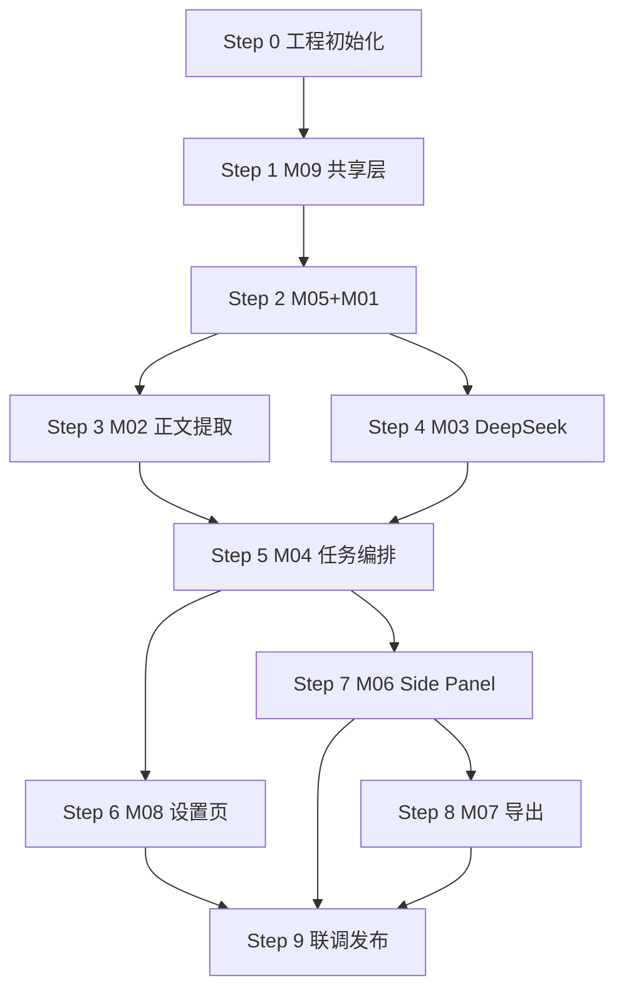

# Chrome 浏览器文章翻译插件 — 实现步骤

| 项目 | 说明 |
|------|------|
| 文档版本 | v1.0 |
| 文档类型 | 实现步骤（Implementation Guide） |
| 依据文档 | [功能模块.md](./功能模块.md)、[技术方案.md](./技术方案.md)、[需求文档.md](./需求文档.md) |
| 适用范围 | 分阶段编码、联调、验收的操作顺序；**不包含**具体代码 |
| 最后更新 | 2026-06-02 |

---

## 1. 文档体系与是否可以直接写代码

### 1.1 三份文档各自解决什么问题

| 文档 | 回答的问题 | 对编码的作用 |
|------|------------|--------------|
| [需求文档.md](./需求文档.md) | **做什么、验收标准是什么** | 功能边界、不做历史记录等产品约束 |
| [技术方案.md](./技术方案.md) | **用什么技术、怎么串起来** | 架构、选型、消息协议、目录结构 |
| [功能模块.md](./功能模块.md) | **拆成哪些模块、谁负责什么** | 模块边界、接口、依赖、模块级验收 |

### 1.2 只有功能模块文档够不够写代码？

**结论：够，但更适合有经验的开发者；建议配合本实现步骤文档一起用。**

| 维度 | 功能模块文档已具备 | 仍容易遗漏（本步骤文档补充） |
|------|-------------------|------------------------------|
| 模块边界与职责 | ✅ | — |
| 类型与消息协议 | ✅（见 M09、M01） | — |
| 模块依赖顺序 | ✅（Phase 1–8 概要） | 每步要创建哪些文件、先写哪个函数 |
| 工程脚手架 | ❌ | package.json、Vite、manifest、加载扩展 |
| 可验证检查点 | 模块级 checkbox | 每步完成后如何本地验证 |
| 联调顺序 | 场景描述 | Background ↔ Content ↔ Side Panel 联调步骤 |
| 环境与前缀条件 | ❌ | Node 版本、DeepSeek Key、Chrome 版本 |

**推荐用法**

- **单人 / 熟 Chrome 扩展**：功能模块 + 技术方案 → 可直接编码；本文档作 checklist。
- **首次做 MV3 扩展 / 用 AI 分步生成代码**：按本文档 **Step 0 → Step 8** 顺序推进，每步验收后再进入下一步。
- **需求变更时**：先改需求文档 → 技术方案 → 功能模块 → 再更新本步骤文档对应 Step。

---

## 2. 实现总览

### 2.1 阶段与模块对应

```
Step 0  工程初始化
Step 1  M09 共享层
Step 2  M05 会话与存储 + M01 消息总线（最小通路）
Step 3  M02 正文提取
Step 4  M03 DeepSeek 翻译引擎
Step 5  M04 翻译任务编排（端到端翻译）
Step 6  M08 设置页
Step 7  M06 Side Panel 主界面
Step 8  M07 导出与下载
Step 9  联调、测试与发布准备
```

### 2.2 前置条件

| 项 | 要求 |
|----|------|
| Node.js | 18+ |
| 包管理器 | npm / pnpm / yarn 任选 |
| 浏览器 | Chrome 120+（支持 Side Panel API） |
| DeepSeek | 可用 API Key（开发阶段手动填入 Options） |
| 文档 | 三份设计文档已就绪（当前仓库 `docs/` 下） |

---

## 3. Step 0 — 工程初始化

**目标**：空仓库可 `build`，Chrome 能加载未实现业务的扩展壳子。

**涉及模块**：无（基础设施）

### 3.1 任务清单

| # | 任务 | 产出 |
|---|------|------|
| 0.1 | 初始化 `package.json`，安装 TypeScript、Vite、扩展打包插件（`@crxjs/vite-plugin` 或等价方案） | 依赖就绪 |
| 0.2 | 配置 `tsconfig.json`（严格模式、`paths` 可选） | TS 编译配置 |
| 0.3 | 配置 `vite.config.ts` 多入口：`background`、`content`、`sidepanel`、`options` | 构建配置 |
| 0.4 | 编写 `manifest.json`（MV3）：`storage`、`activeTab`、`sidePanel`、`scripting`；`host_permissions`: `https://api.deepseek.com/*` | 扩展清单 |
| 0.5 | 创建 `public/icons/` 占位图标（16/32/48/128） | 图标资源 |
| 0.6 | 各入口最小占位文件：`src/background/index.ts`、`src/content/index.ts`、`src/sidepanel/index.html`、`src/options/index.html` | 空壳页面 |
| 0.7 | 配置 `npm run dev`（watch）与 `npm run build` | 脚本命令 |
| 0.8 | 更新 `README.md`：加载 `dist/` 到 Chrome 的简要说明 | 开发说明 |

### 3.2 目录创建（与技术方案一致）

按 [技术方案.md §7](./技术方案.md) 创建 `src/` 子目录及空文件占位，避免后续步骤路径不一致。

### 3.3 本步验收

- [ ] `npm run build` 成功，生成 `dist/`
- [ ] Chrome → 扩展程序 → 加载已解压的扩展 → 无报错
- [ ] 点击工具栏图标可打开 Side Panel（空白页即可）
- [ ] Options 页可打开（空白页即可）

---

## 4. Step 1 — M09 共享类型与工具

**目标**：全项目共用类型、常量、工具函数定义完成，后续模块统一引用。

**参考**：[功能模块.md §10](./功能模块.md#10-m09--共享类型与工具模块)

### 4.1 任务清单

| # | 文件 | 任务 |
|---|------|------|
| 1.1 | `src/shared/types.ts` | 定义 `ContentBlock`、`ArticlePayload`、`TranslatedBlock`、`TranslationDoc`、`JobState`、`Settings`、`TabSession`、消息请求/响应类型 |
| 1.2 | `src/shared/constants.ts` | 定义 `MessageType` 枚举、错误码 `ErrorCode`、支持语言列表 `SUPPORTED_LANGUAGES`、分片默认上限常量 |
| 1.3 | `src/shared/utils/language.ts` | `getLanguageLabel(code)`、`normalizeLangCode(code)` |
| 1.4 | `src/shared/utils/filename.ts` | `sanitizeFilename(title)`、`buildExportFilename(title, lang, ext)` |

### 4.2 类型定义要点（实现时对照）

| 类型 | 关键字段 |
|------|----------|
| `JobState` | `'idle' \| 'extracting' \| 'translating' \| 'done' \| 'error'` |
| `Settings` | `apiKey?`, `defaultTargetLang`, `sourceLang`, `lastDownloadFormat?` |
| `TranslationDoc` | `titleTranslated`, `blocks`, `targetLang`, `translatedAt`, `sourceUrl?` |

### 4.3 本步验收

- [ ] 项目内无重复定义同名类型
- [ ] `MessageType` 覆盖 M01 路由表全部消息（与功能模块 §2.4、§5.6 一致）
- [ ] `filename` 工具对 `/\:*?"<>|` 等字符处理正确（可写单元测试）

---

## 5. Step 2 — M05 会话与存储 + M01 消息总线

**目标**：Background 能读写配置、维护 tab 会话；消息能路由并响应 `GET_SETTINGS` / `GET_SESSION_STATE`。

**参考**：M05 [§6](./功能模块.md#6-m05--会话与存储模块)、M01 [§2](./功能模块.md#2-m01--扩展基础与消息总线)

### 5.1 任务清单

| # | 文件 | 任务 |
|---|------|------|
| 2.1 | `src/background/settings.ts` | `getSettings()`、`saveSettings(partial)`、`maskApiKey(key)` |
| 2.2 | `src/background/session-cache.ts` | 内存 `Map<tabId, TabSession>`；`get/set/clear`；监听 `chrome.tabs.onRemoved` |
| 2.3 | `src/background/message-router.ts` | `registerHandler(type, fn)`、`dispatch(message)` |
| 2.4 | `src/background/index.ts` | 注册 `onMessage`；绑定 `GET_SETTINGS`、`SAVE_SETTINGS`、`GET_SESSION_STATE`；`action.onClicked` → `sidePanel.open` |

### 5.2 实现要点

- `getSettings` 返回时 **不包含** 完整 `apiKey`（掩码或 `hasApiKey: boolean`）
- `saveSettings` 仅写入 `chrome.storage.local` 允许字段，**禁止**写入 `translationDoc` 等译文字段
- Session 仅存内存；可选同步 `chrome.storage.session`（非必须，v1.0 内存即可）

### 5.3 本步验收

- [ ] DevTools → Application → Extension storage 可见配置项
- [ ] Side Panel / Options 发 `GET_SETTINGS` 能收到响应（可用临时测试按钮或 console）
- [ ] 关闭 tab 后，该 `tabId` 的 session 被清除
- [ ] 点击扩展图标打开 Side Panel

---

## 6. Step 3 — M02 正文提取

**目标**：在文章页点击翻译前，Content Script 能返回结构化 `ArticlePayload`。

**参考**：[功能模块.md §3](./功能模块.md#3-m02--正文提取模块)

### 6.1 任务清单

| # | 文件 | 任务 |
|---|------|------|
| 3.1 | `src/content/dom-to-blocks.ts` | 遍历 DOM 节点 → `ContentBlock[]`（heading/paragraph/list/blockquote/code） |
| 3.2 | `src/content/extractor.ts` | Readability 主路径 + `article`/`main` 兜底；组装 `ArticlePayload` |
| 3.3 | `src/content/index.ts` | 监听 `EXTRACT_ARTICLE`，返回 payload |
| 3.4 | Background 辅助 | 在 M04 之前可先写 `extractFromTab(tabId)`：`scripting.executeScript` 注入 + `tabs.sendMessage` |

### 6.2 依赖安装

- 可选：`@mozilla/readability` + `@types/dom`（或 jsdom 仅用于测试）

### 6.3 本步验收

- [ ] 在 Medium / 知乎 / 普通博客页手动触发提取，console 打印非空 `blocks`
- [ ] 标题、段落、列表层级基本正确
- [ ] 无正文页（如 chrome://）返回空 blocks，不崩溃
- [ ] Content Script 不引用 `deepseek/` 目录

---

## 7. Step 4 — M03 DeepSeek 翻译引擎

**目标**：给定 `ContentBlock[]` + API Key，能分片调用 DeepSeek 并返回 `TranslatedBlock[]`（可在 Node 或 Background 中单测）。

**参考**：[功能模块.md §4](./功能模块.md#4-m03--deepseek-翻译引擎模块)

### 7.1 任务清单

| # | 文件 | 任务 |
|---|------|------|
| 4.1 | `src/shared/deepseek/prompts.ts` | `buildSystemPrompt()`、`buildUserPrompt(chunk, targetLang, sourceLang)` |
| 4.2 | `src/shared/deepseek/chunker.ts` | `planChunks(blocks, maxChars)` → 分片计划 |
| 4.3 | `src/shared/deepseek/client.ts` | `chatCompletion(apiKey, messages, options)` + 超时 + HTTP 错误映射 |
| 4.4 | `src/shared/deepseek/parser.ts` | 解析 API 响应文本 → `TranslatedBlock[]` |
| 4.5 | 聚合导出 | `translateArticle(params)` 顺序调用各片，`onProgress(i, n)` 回调 |

### 7.2 实现要点

- Base URL：`https://api.deepseek.com/v1/chat/completions`
- 模型：`deepseek-chat`；`temperature: 0.3`；v1.0 非流式
- 401 → `AUTH_INVALID`；429 → `QUOTA_EXCEEDED`；超时 → `TIMEOUT`

### 7.3 本步验收

- [ ] 单元测试：`chunker` 不截断单块；超长文分为多片
- [ ] 单元测试：`mapApiError` 映射正确
- [ ] 集成测试（真实 Key，可选）：短段落翻译成功
- [ ] 模块内不调用 `chrome.*` API

---

## 8. Step 5 — M04 翻译任务编排

**目标**：Side Panel 发 `TRANSLATE_START` 后，Background 完成「提取 → 翻译 → 写 session → 通知 UI」全链路。

**参考**：[功能模块.md §5](./功能模块.md#5-m04--翻译任务编排模块)

### 8.1 任务清单

| # | 文件 | 任务 |
|---|------|------|
| 5.1 | `src/background/translate-job.ts` | `startTranslateJob(params)` 状态机实现 |
| 5.2 | `message-router` | 注册 `TRANSLATE_START` → translate-job |
| 5.3 | 进度推送 | 翻译每片完成 → `chrome.runtime.sendMessage` 或 Port → `TRANSLATE_PROGRESS` |
| 5.4 | 结果/错误 | 成功 → `TRANSLATE_SUCCESS` + session 写入 `TranslationDoc`；失败 → `TRANSLATE_ERROR` |
| 5.5 | 防重复 | `translating` 状态拒绝同 tab 新任务 |

### 8.2 编排顺序（与功能模块 §11.1 一致）

1. 读 Settings，无 Key → `AUTH_INVALID`
2. `extracting` → 调 M02
3. 空 blocks → `NO_CONTENT`
4. `translating` → 调 M03，推送进度
5. 合并为 `TranslationDoc` → 写入 M05 session
6. `done` → 通知 M06

### 8.3 本步验收

- [ ] 配置 Key 后，在测试页发起翻译，session 中有完整 `TranslationDoc`
- [ ] 翻译中重复点击不产生并行 DeepSeek 请求
- [ ] 错误 Key 返回明确错误码
- [ ] 进度消息 `current/total` 递增合理

**里程碑**：至此已完成 **MVP 核心后端**，UI 仍可用 DevTools 手动发消息验证。

---

## 9. Step 6 — M08 设置管理

**目标**：用户可在 Options 页配置 API Key 与默认语言。

**参考**：[功能模块.md §9](./功能模块.md#9-m08--设置管理模块)

### 9.1 任务清单

| # | 文件 | 任务 |
|---|------|------|
| 6.1 | `src/options/index.html` | 表单：API Key（password）、目标语言、源语言、保存、清除 |
| 6.2 | `src/options/main.ts` | 加载 `GET_SETTINGS`；保存 `SAVE_SETTINGS`；Key 掩码显示 |
| 6.3 | `src/options/styles.css` | 简约样式 |
| 6.4 | 文案 | 隐私说明：正文将发送至 DeepSeek（F-054） |

### 9.2 本步验收

- [ ] 保存 Key 后，Step 5 的翻译流程可成功
- [ ] 页面不显示完整 Key
- [ ] 清除配置后翻译被拦截
- [ ] 默认语言保存后在下次翻译生效

---

## 10. Step 7 — M06 Side Panel 主界面

**目标**：用户通过 Side Panel 完成翻译、看进度、读译文，无需 DevTools。

**参考**：[功能模块.md §7](./功能模块.md#7-m06--side-panel-主界面模块)

### 10.1 任务清单

| # | 文件 | 任务 |
|---|------|------|
| 7.1 | `src/sidepanel/index.html` | 顶栏（设置、语言）、翻译按钮、状态区、译文区、下载区占位 |
| 7.2 | `src/sidepanel/main.ts` | 绑定事件；`GET_SESSION_STATE` 恢复状态；发 `TRANSLATE_START` |
| 7.3 | 消息订阅 | 监听 `TRANSLATE_PROGRESS` / `SUCCESS` / `ERROR` 更新 UI |
| 7.4 | 渲染 | `renderTranslationDoc(doc)`：按 block 类型渲染标题/段落/列表 |
| 7.5 | UI 状态机 | 未配置 Key / 空闲 / 翻译中 / 成功 / 失败 五态 |
| 7.6 | `src/sidepanel/styles.css` | 简约布局；译文区 `overflow-y: auto` |

### 10.2 本步验收

- [ ] 打开 Side Panel 自动恢复当前 tab 已有译文（若 session 存在）
- [ ] 翻译全流程仅通过 UI 可操作
- [ ] 翻译中按钮 disabled，展示进度
- [ ] 失败显示重试，重试可再次发起
- [ ] 无「历史记录」相关 UI
- [ ] Tab 导航到新 URL 后提示重新翻译或清空旧译文

---

## 11. Step 8 — M07 导出与下载

**目标**：翻译成功后可下载 Markdown 与 PDF。

**参考**：[功能模块.md §8](./功能模块.md#8-m07--导出与下载模块)

### 11.1 任务清单

| # | 文件 | 任务 |
|---|------|------|
| 8.1 | `src/sidepanel/export/markdown.ts` | `exportMarkdown(doc)` → `{ content, filename }` |
| 8.2 | `src/sidepanel/export/pdf.ts` | `exportPdf(doc)` → `{ blob, filename }`；集成 pdfmake |
| 8.3 | `assets/fonts/` | 中文字体子集，构建时复制到 dist |
| 8.4 | 下载工具 | `downloadBlob(blob, filename)`：Object URL + `<a download>` |
| 8.5 | M06 集成 | 格式单选；未翻译时下载 disabled；记住会话内 `lastDownloadFormat`（可选写 storage） |

### 11.2 本步验收

- [ ] Markdown 下载后 UTF-8 可读，标题/列表结构正确
- [ ] PDF 中文无乱码，内容完整
- [ ] 文件名符合 `{title}_{lang}_{date}.md` 规则
- [ ] 未翻译时无法下载空文件

---

## 12. Step 9 — 联调、测试与发布准备

**目标**：对照需求验收，修复集成问题，产出可 sideload 的 release 包。

### 12.1 联调检查清单

| # | 场景 | 涉及模块 | 预期 |
|---|------|----------|------|
| 9.1 | 首次安装无 Key | M06, M08 | 引导配置，翻译不可用 |
| 9.2 | 完整 happy path | 全部 | 翻译 → 阅读 → MD/PDF 下载 |
| 9.3 | 长文（>10 片） | M03, M04, M06 | 进度正常，最终合并完整 |
| 9.4 | 无效 Key | M03, M04, M06 | 明确错误，可去设置修改 |
| 9.5 | 空正文页 | M02, M04, M06 | 「无法识别文章内容」 |
| 9.6 | 关闭 tab | M05 | 译文不可找回（AC-06） |
| 9.7 | 翻译中连点 | M04, M06 | 无重复任务（AC-07） |

### 12.2 自动化测试（建议）

| 范围 | 命令/方式 |
|------|-----------|
| 单元测试 | `chunker`、`parser`、`markdown`、`filename` |
| 集成测试 | Mock fetch DeepSeek → translate-job 合并 |
| 手工站点 | 知乎、Medium、GitHub Blog、维基百科文章页 |

### 12.3 需求验收对照（AC-01～AC-07）

| 编号 | 验证 Step |
|------|-----------|
| AC-01 | Step 5 + 7，典型文章页 |
| AC-02 | Step 4 + 6，错误 Key |
| AC-03 | Step 8，Markdown |
| AC-04 | Step 8，PDF |
| AC-05 | Step 7，无历史 UI |
| AC-06 | Step 9.6 |
| AC-07 | Step 9.7 |

### 12.4 发布准备

| # | 任务 |
|---|------|
| 9.8 | `npm run build` 生产构建，检查 dist 体积（关注 PDF 字体） |
| 9.9 | 编写 Chrome 商店描述与权限说明（`storage`、`activeTab`、`sidePanel`、`scripting`、`api.deepseek.com`） |
| 9.10 | 可选：`scripts/pack.js` 打 zip |
| 9.11 | README：安装、配置 Key、使用流程、隐私说明 |

### 12.5 本步验收

- [ ] AC-01～AC-07 全部通过
- [ ] 无 console 未捕获异常
- [ ] release 包可在干净 Chrome 配置文件加载运行

---

## 13. 步骤依赖图



**说明**：Step 6（M08）与 Step 7（M06）可在 Step 5 完成后 **并行**；Step 8 依赖 Step 7 中已有 `TranslationDoc` 展示。

---

## 14. 常见问题与实现决策

| 问题 | 建议 |
|------|------|
| Side Panel 如何获取当前 tabId？ | `chrome.tabs.query({ active: true, currentWindow: true })` |
| Content Script 注入时机？ | 翻译时 `scripting.executeScript`，避免全站常驻 |
| 进度推送用 Message 还是 Port？ | 片数少时用 Message；长文可改 Port |
| PDF 字体太大？ | subsetting，仅保留常用汉字 |
| Service Worker 休眠？ | 分片缩短单次请求；必要时 `chrome.alarms` 保活 |
| 译文存哪？ | 仅 M05 内存 session，不写 local/sync |

---

## 15. 文档修订记录

| 版本 | 日期 | 说明 |
|------|------|------|
| v1.0 | 2026-06-02 | 初稿：依据功能模块 v1.0 编写分步实现指南 |
