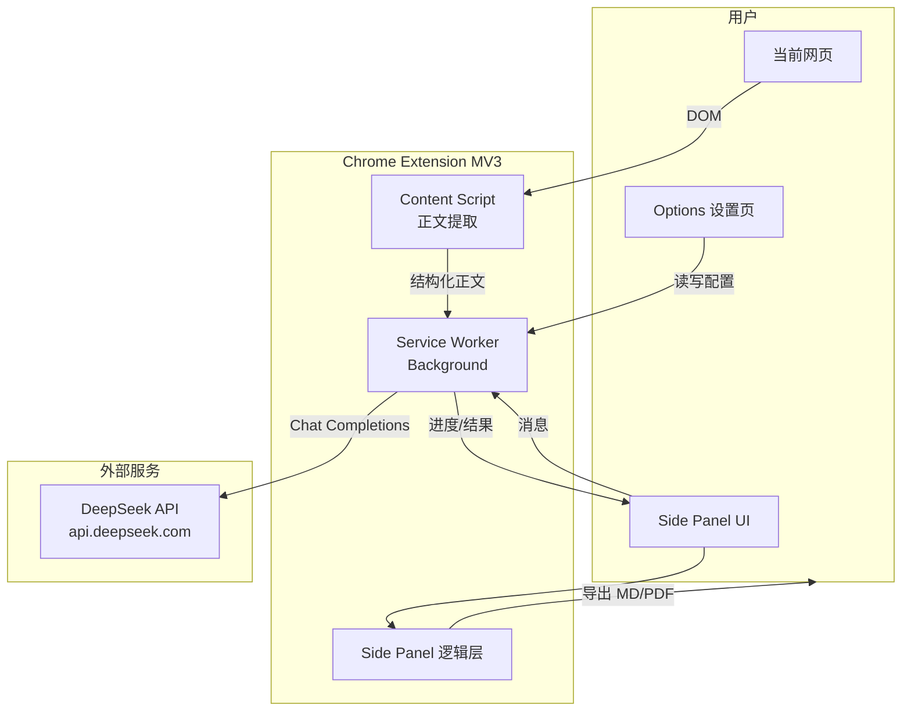
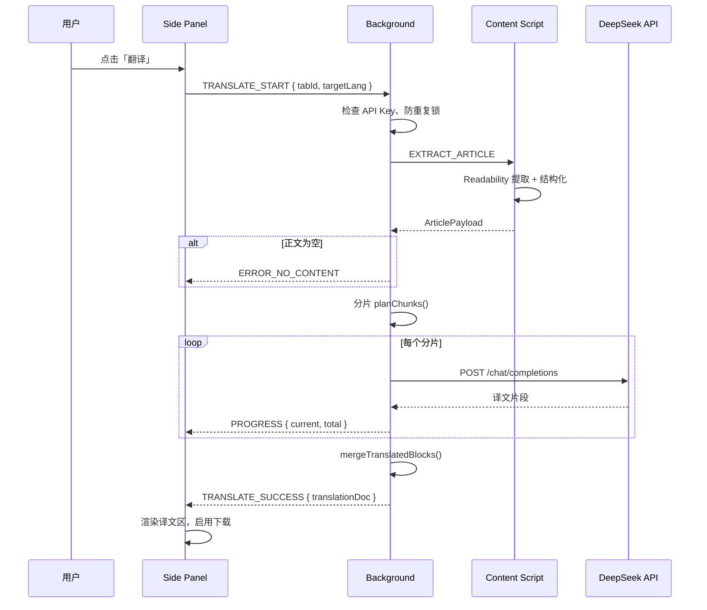

# Chrome 浏览器文章翻译插件 — 技术方案

| 项目 | 说明 |
|------|------|
| 文档版本 | v1.0 |
| 文档类型 | 技术方案（TDD） |
| 依据文档 | [需求文档.md](./需求文档.md) v1.0 |
| 适用范围 | 架构、模块划分、接口约定、目录结构；**不包含**具体代码实现 |
| 最后更新 | 2026-06-02 |

---

## 1. 方案概述

### 1.1 建设目标

以 **Chrome Extension（Manifest V3）** 形态实现需求文档中的 v1.0 能力：在当前标签页提取文章正文 → 调用 **DeepSeek API** 完成全文翻译 → 在插件 UI 中展示译文 → 支持 **Markdown / PDF** 本地下载。不实现翻译历史持久化，仅保留配置项与当前会话内的临时状态。

### 1.2 技术选型总览

| 领域 | 选型 | 说明 |
|------|------|------|
| 扩展规范 | Chrome Manifest V3 | 符合 Chrome 商店与当前主流实践 |
| 主界面载体 | **Side Panel（侧边栏）** | 长文滚动阅读体验优于 Popup；工具栏图标点击打开侧边栏 |
| 前端构建 | Vite + TypeScript | 多入口打包（background / content / sidepanel / options） |
| 正文提取 | Content Script + Readability 类算法 | 在页面 DOM 中识别正文并输出结构化文档 |
| 翻译服务 | DeepSeek Chat Completions API | OpenAI 兼容接口，`deepseek-chat` 模型 |
| 配置存储 | `chrome.storage.local` | 仅存 API Key、默认语言等设置，不存译文 |
| 会话状态 | 内存 + `chrome.storage.session`（可选） | 译文与任务状态按标签页会话持有，关闭即失效 |
| Markdown 导出 | 结构化译文直接序列化 | UTF-8 `.md` 文件 |
| PDF 导出 | 客户端生成（如 pdfmake / jsPDF + 字体） | 内置中文字体子集，保证中文可读 |

### 1.3 与需求文档的映射

| 需求要点 | 技术对策 |
|----------|----------|
| F-001～F-003 全文翻译 | Content Script 提取 → Background 分片调用 DeepSeek → Side Panel 展示 |
| F-004 DeepSeek | Background 统一发起 HTTPS 请求，UI 不直连密钥 |
| F-050～F-053 无历史 | 禁止将译文写入 `local`/`sync` 长期库；不建 IndexedDB 历史表 |
| F-030～F-037 下载 | Side Panel 内触发 Blob 下载 |
| UI-002 Popup 或 Side Panel | 方案选定 Side Panel，并在 manifest 中注册 |
| F-007 长文 | 正文分块翻译 + 进度回调 |
| NF-030 API Key | `storage.local` 加密存储约定 + Options 页掩码展示 |

---

## 2. 系统架构

### 2.1 逻辑架构图



### 2.2 进程与职责

| 模块 | 运行环境 | 职责 |
|------|----------|------|
| **Content Script** | 隔离世界，注入目标页 | 调用正文提取器，返回标题、层级块（段落/标题/列表）、纯文本/Markdown 中间表示 |
| **Service Worker (Background)** | 扩展后台 | 消息路由；读取配置；正文分片；调用 DeepSeek；聚合译文；错误分类；不向持久层写入译文 |
| **Side Panel** | 扩展页面 | 翻译/下载主流程 UI；展示译文与进度；触发下载；会话内 UI 状态（如上次下载格式） |
| **Options** | 扩展页面 | API Key、默认目标语言、隐私说明入口；校验 Key 格式（可选连通性检测） |

### 2.3 为何采用 Side Panel 而非 Popup

- 需求 F-020 要求长文完整可读：Popup 高度受限，体验差。
- Side Panel 与标签页同生命周期，关闭侧边栏后译文可不保留（配合会话存储策略满足 F-052）。
- 工具栏单图标 → `sidePanel.open()`，符合「简约、主流程集中」原则。

---

## 3. 核心流程设计

### 3.1 翻译主流程（时序）



### 3.2 下载流程

1. 用户选择 Markdown 或 PDF。
2. Side Panel 从当前内存中的 `translationDoc` 生成对应二进制/文本。
3. 使用 `URL.createObjectURL` + 隐藏 `<a download>` 或 `chrome.downloads.download`（若申请 `downloads` 权限）保存到本地。
4. 文件名规则：`{sanitize(title)}_{targetLang}_{yyyyMMdd}.{md|pdf}`（对应 F-034）。

### 3.3 防重复提交（F-011 / AC-07）

- Background 维护 `Map<tabId, JobState>`：`idle | extracting | translating | done | error`。
- `translating` 期间拒绝同 tab 新任务；Side Panel 禁用翻译按钮并展示进度。
- 用户点击「重试」时，仅当状态为 `error` 或 `done` 时允许重新 `TRANSLATE_START`（`done` 时视为覆盖当前会话译文，仍不写历史库）。

---

## 4. 模块详细设计

### 4.1 正文提取（Content Script）

#### 4.1.1 输入与输出

**输入**：当前 `document`（`http/https` 页面）。

**输出 `ArticlePayload`（逻辑结构）**：

| 字段 | 类型 | 说明 |
|------|------|------|
| `url` | string | 页面 URL |
| `title` | string | 原文标题（`<title>` 或文内 h1） |
| `byline` | string? | 作者/日期（可选） |
| `langHint` | string? | `html[lang]` 或启发式语言提示 |
| `blocks` | `ContentBlock[]` | 有序内容块 |
| `plainText` | string | 扁平纯文本（兜底与长度估算） |

**`ContentBlock`**：

| 字段 | 说明 |
|------|------|
| `type` | `heading` \| `paragraph` \| `list` \| `blockquote` \| `code` |
| `level` | 标题 1–6；列表嵌套层级 |
| `text` | 块内文本 |
| `items` | 列表项数组（`type=list` 时） |

#### 4.1.2 提取策略

1. **主路径**：基于 Readability 算法定位主内容节点，遍历子节点映射为 `ContentBlock`（保留 h1–h6、p、ul/ol、blockquote、pre）。
2. **兜底**：主路径失败时，对 `<article>`、`.post-content`、`main` 等常见选择器尝试；仍失败则返回空 `blocks` → 对应产品态「无法识别文章内容」。
3. **噪声过滤**：移除 `nav/footer/aside/script/iframe`；不过度追求评论区剔除（与 PRD「可读正文优先」一致）。

#### 4.1.3 注入时机

- `manifest.json` 声明 `content_scripts`，`matches: ["<all_urls>"]`，`run_at: document_idle`。
- 实际提取在用户点击翻译时通过 `chrome.scripting.executeScript` **按需注入**（若已注入则直接发消息），减少对所有页面的常驻开销（实现阶段二选一，推荐按需注入 + `activeTab`）。

---

### 4.2 翻译服务（Background + DeepSeek）

#### 4.2.1 API 约定

| 项 | 值 |
|----|-----|
| Base URL | `https://api.deepseek.com` |
| 路径 | `POST /v1/chat/completions` |
| 认证 | `Authorization: Bearer <API_KEY>` |
| 模型 | `deepseek-chat`（默认）；可配置项预留 `deepseek-reasoner` 但不作为 v1.0 默认 |
| 兼容性 | OpenAI Chat Completions 请求/响应格式 |

#### 4.2.2 请求构造原则

- **System Prompt**：约定角色为专业翻译；要求保留 Markdown 结构；仅输出译文、不解释。
- **User Message**：携带目标语言、源语言（`auto` 或用户选择）、当前分片原文（带块类型标记，便于模型还原层级）。
- **参数建议**：`temperature: 0.3`（偏稳定）；`max_tokens` 按分片预估；流式 `stream: false`（v1.0 简化聚合，后续可改 stream 提升首字体验）。

#### 4.2.3 长文分片（F-007）

| 策略项 | 说明 |
|--------|------|
| 分片单位 | 按 `ContentBlock` 边界聚合，避免截断段落 |
| 大小上限 | 单请求字符/token 上限（如 6k–8k 字符/片，实现阶段按 DeepSeek 限制微调） |
| 顺序 | 严格顺序请求或有限并发（建议 v1.0 **顺序**，降低乱序与限流风险） |
| 失败 | 任一分片失败 → 整体 `error`，保留已完成片可选丢弃（v1.0 不部分展示） |
| 进度 | `currentChunk / totalChunks` 推送 Side Panel |

#### 4.2.4 响应解析

- 从 `choices[0].message.content` 取译文文本。
- 按约定分隔符或块标记解析回 `TranslatedBlock[]`，与原文 `blocks` 一一对应或按序合并。
- 校验：分片输出非空；合并后总字数低于原文一定比例时标记 `quality_warning`（仅日志，不阻断）。

#### 4.2.5 错误分类（映射 F-013 用户文案）

| HTTP / 业务 | 内部码 | 用户提示 |
|-------------|--------|----------|
| 401 | `AUTH_INVALID` | API Key 无效，请检查设置 |
| 402 / 429 | `QUOTA_EXCEEDED` | 配额不足或请求过于频繁 |
| 5xx / 网络 | `NETWORK_ERROR` | 网络异常，请稍后重试 |
| 超时 | `TIMEOUT` | 翻译超时，可重试 |
| 空正文 | `NO_CONTENT` | 无法识别文章内容 |
| 其他 | `UNKNOWN` | 翻译失败，请重试 |

---

### 4.3 会话与存储设计（满足「无历史」）

#### 4.3.1 存储分层

| 存储 | 内容 | 生命周期 |
|------|------|----------|
| `chrome.storage.local` | `apiKey`, `defaultTargetLang`, `sourceLang`, `lastDownloadFormat`（可选，仅格式偏好） | 长期，用户可清除 |
| 内存 / `chrome.storage.session` | 当前 tab 的 `translationDoc`, `jobState`, `extractedArticle` | 浏览器会话；tab 关闭或扩展重载后清除 |
| **禁止** | 译文列表、URL 时间线、IndexedDB 历史表 | — |

#### 4.3.2 Tab 会话绑定

- Background 以 `tabId` 为键持有 `SessionCache`。
- 监听 `tabs.onRemoved` 清理对应缓存。
- Side Panel 打开时向 Background 查询当前 tab 状态；若 tab 已导航到新 URL，视为新页面，清空旧译文（或提示重新翻译）。

#### 4.3.3 API Key 安全（NF-030）

- 仅存 `chrome.storage.local`，不上传自有服务器。
- Options 页展示掩码（如 `sk-****abcd`）。
- Side Panel 不显示完整 Key；Background 读取后仅用于请求头。
- 可选：首次保存时对 Key 做格式校验（`sk-` 前缀等），不替代服务端 401 校验。

---

### 4.4 导出模块（Side Panel）

#### 4.4.1 中间模型 `TranslationDoc`

| 字段 | 说明 |
|------|------|
| `titleTranslated` | 译文标题 |
| `blocks` | 译文块（结构同 `ContentBlock`） |
| `targetLang` | 目标语言代码 |
| `translatedAt` | ISO 时间（仅用于文件头/F-021 会话展示） |
| `sourceUrl` | 原文 URL（可选写入 MD 元信息） |

#### 4.4.2 Markdown 导出（F-036）

- 遍历 `blocks` 生成标准 Markdown（`#` 标题、`-` 列表、段落空行分隔）。
- 文件头可选 YAML front matter（`title`, `date`, `lang`），保持 UTF-8 无 BOM。
- Blob `text/markdown;charset=utf-8`。

#### 4.4.3 PDF 导出（F-037）

- **方案 A（推荐）**：`pdfmake` + 内嵌 **Noto Sans SC** 或 **Source Han Sans** 子集字体（VFS），按 `blocks` 生成 `content` 数组（标题加大字号、段落 `margin`）。
- **方案 B**：将译文 HTML 渲染到隐藏容器 + `html2pdf.js`；对分页与字体嵌入控制较弱，作备选。
- 页边距、正文字号 11–12pt、行距 1.4–1.6，满足可读性即可。

#### 4.4.4 下载实现

- 优先 **Blob + 程序化点击下载**，避免必需 `downloads` 权限。
- 若使用 `chrome.downloads.download`，需在 manifest 声明 `downloads` 权限并在商店说明用途。

---

### 4.5 UI 设计（Side Panel + Options）

#### 4.5.1 Side Panel 布局

```
┌─────────────────────────────────┐
│ [设置]              目标语言 ▼  │
├─────────────────────────────────┤
│  [ 翻译全文 ]    （主按钮）      │
│  状态：空闲 / 翻译中 35% / 失败  │
├─────────────────────────────────┤
│  译文区（scroll）                │
│  # 标题                          │
│  段落...                         │
├─────────────────────────────────┤
│  格式： (•) Markdown  ( ) PDF   │
│  [ 下载 ]                        │
└─────────────────────────────────┘
```

- 未配置 Key：顶部 Banner + 翻译按钮跳转 Options。
- 未翻译：译文区占位文案；下载区 `disabled`。
- 翻译中：进度条或百分比 + 取消按钮（v1.0 可选，取消即 abort fetch）。

#### 4.5.2 Options 页

- DeepSeek API Key（password 输入）
- 默认目标语言、源语言（auto / en / ja / …）
- 隐私说明：正文将发送至 DeepSeek API（F-054）
- 清除配置按钮

---

## 5. 消息协议（扩展内通信）

采用 `chrome.runtime.sendMessage` / `Port` 长连接（进度频繁时可用 Port）。

| 消息类型 | 方向 | 载荷要点 | 响应 |
|----------|------|----------|------|
| `EXTRACT_ARTICLE` | BG → CS | — | `ArticlePayload` |
| `TRANSLATE_START` | SP → BG | `tabId`, `targetLang`, `sourceLang?` | `ack` / `error` |
| `TRANSLATE_PROGRESS` | BG → SP | `tabId`, `current`, `total` | — |
| `TRANSLATE_SUCCESS` | BG → SP | `translationDoc` | — |
| `TRANSLATE_ERROR` | BG → SP | `code`, `message` | — |
| `GET_SESSION_STATE` | SP → BG | `tabId` | `jobState`, `translationDoc?` |
| `GET_SETTINGS` | SP/Opt → BG | — | `settings`（不含完整 key） |
| `SAVE_SETTINGS` | Opt → BG | `apiKey?`, `defaultTargetLang?` | `ok` |

---

## 6. Chrome 扩展配置要点

### 6.1 manifest.json 核心字段（逻辑说明）

| 字段 | 建议值 |
|------|--------|
| `manifest_version` | `3` |
| `permissions` | `storage`, `activeTab`, `sidePanel`, `scripting` |
| `host_permissions` | `https://api.deepseek.com/*`；正文提取若按需注入可仅 `activeTab` 隐式访问当前页 |
| `background` | `service_worker`: `background.js`（打包产物） |
| `side_panel` | `default_path`: `sidepanel/index.html` |
| `action` | 图标 + `default_title`；点击打开 Side Panel |
| `options_page` | `options/index.html` |
| `content_security_policy` | 扩展页禁止远程脚本；API 仅 Background 请求 |

### 6.2 权限最小化（NF-031）

- 不申请 `<all_urls>` 常驻 host 权限若采用 `activeTab` + 按需 `scripting`。
- 不申请 `history`, `bookmarks`, `cookies`。
- 不申请自有后端域名。

---

## 7. 项目目录结构

```
ai-chrome-deepseek-translate-plugin/
├── README.md
├── package.json
├── tsconfig.json
├── vite.config.ts                 # 多入口：background / content / sidepanel / options
├── manifest.json                  # MV3 清单（构建时复制或插件生成）
├── docs/
│   ├── 需求文档.md
│   └── 技术方案.md
├── public/
│   └── icons/                     # 16/32/48/128 扩展图标
├── src/
│   ├── background/
│   │   ├── index.ts               # Service Worker 入口
│   │   ├── message-router.ts      # 消息分发
│   │   ├── session-cache.ts       # Tab 会话缓存（译文/任务状态）
│   │   ├── translate-job.ts       # 翻译任务编排、防重
│   │   └── settings.ts            # 读写 chrome.storage.local
│   ├── content/
│   │   ├── index.ts               # Content Script 入口
│   │   ├── extractor.ts           # 正文提取主逻辑
│   │   └── dom-to-blocks.ts       # DOM → ContentBlock[]
│   ├── shared/
│   │   ├── types.ts               # ArticlePayload, ContentBlock, TranslationDoc
│   │   ├── constants.ts           # 消息类型、错误码、语言列表
│   │   ├── deepseek/
│   │   │   ├── client.ts          # HTTP 封装（fetch + 超时）
│   │   │   ├── chunker.ts         # 分片策略
│   │   │   ├── prompts.ts         # System/User 模板
│   │   │   └── parser.ts          # 响应 → TranslatedBlock
│   │   └── utils/
│   │       ├── filename.ts        # 下载文件名 sanitize
│   │       └── language.ts        # 语言代码与展示名
│   ├── sidepanel/
│   │   ├── index.html
│   │   ├── main.ts                # UI 绑定、消息订阅
│   │   ├── styles.css
│   │   └── export/
│   │       ├── markdown.ts        # TranslationDoc → .md 字符串
│   │       └── pdf.ts             # TranslationDoc → PDF Blob
│   └── options/
│       ├── index.html
│       ├── main.ts                # 设置表单、保存、掩码展示
│       └── styles.css
├── assets/
│   └── fonts/                     # PDF 用中文字体子集（体积控制）
└── scripts/
    └── pack.js                    # 打包 zip 供商店上传（可选）
```

### 7.1 目录说明

| 路径 | 职责 |
|------|------|
| `src/background` | 翻译编排、DeepSeek 调用、会话与配置，不渲染 UI |
| `src/content` | 仅负责页面正文提取，不调用 API |
| `src/shared` | 跨上下文复用的类型与 DeepSeek 逻辑（Background 引用；避免 Content 引入 API 客户端） |
| `src/sidepanel` | 主交互与导出 |
| `src/options` | 持久配置 |
| `assets/fonts` | PDF 中文显示依赖，构建时打入包内 |

### 7.2 构建产物（dist/）

```
dist/
├── manifest.json
├── background.js
├── content.js
├── sidepanel/
│   ├── index.html
│   └── assets/*.js, *.css
├── options/
│   ├── index.html
│   └── assets/*.js, *.css
├── icons/
└── assets/fonts/                  # PDF 字体
```

---

## 8. 依赖与第三方库（建议）

| 依赖 | 用途 |
|------|------|
| `typescript` | 类型安全 |
| `vite` + `@crxjs/vite-plugin` 或 `vite-plugin-web-extension` | MV3 多入口打包 |
| `@mozilla/readability` | 正文识别（可选，或自研精简版） |
| `pdfmake` | PDF 生成 |
| 无框架 / 轻量 `preact`（可选） | Side Panel UI 体量小，原生 DOM 即可 |

**不引入**：后端服务、数据库、用户账号 SDK。

---

## 9. 非功能需求的技术落实

| 需求 ID | 技术措施 |
|---------|----------|
| NF-001 | 提取在 Content Script 同步完成，目标 < 2s；超时 5s 报错 |
| NF-002 | 分片进度推送；Background `fetch` 设置合理 timeout（如 60s/片） |
| NF-003 | 译文区虚拟滚动（可选，长文 > 2 万字时） |
| NF-010 | Side Panel 单页完成主流程，无多级导航 |
| NF-020 | 目标 Chromium 120+；使用 MV3 标准 API |
| NF-021 | Readability + 站点兜底选择器；失败明确提示 |
| NF-030 | 见 4.3.3 |
| NF-031 | 见第 6 节 |

---

## 10. 测试策略（方案层）

| 类型 | 范围 |
|------|------|
| 单元测试 | `chunker`, `parser`, `markdown` 序列化, `filename` sanitize |
| 集成测试 | Mock DeepSeek 响应 → Background 合并逻辑 |
| 手工测试 | 知乎、Medium、GitHub Blog、维基等典型文章页提取与翻译 |
| 验收对照 | 逐条覆盖需求文档 AC-01～AC-07 |

---

## 11. 风险与对策

| 风险 | 影响 | 对策 |
|------|------|------|
| 站点 DOM 复杂导致提取失败 | 无法翻译 | 兜底选择器 + 明确空态；后续版本站点规则可插拔 |
| 长文触发 API 限流/超时 | 翻译失败 | 分片 + 顺序请求 + 用户可重试；提示预计耗时 |
| PDF 字体体积大 | 包体增大 | 仅嵌入常用汉字子集；构建时 font subsetting |
| MV3 Service Worker 休眠 | 长任务中断 | `chrome.alarms` 保活（谨慎）；或分片缩短单请求时间 |
| API Key 泄露（XSS 于扩展页） | 安全 | 扩展页 CSP 严格；不向 Content Script 传递 Key |
| DeepSeek 服务变更 | 接口不兼容 | 客户端抽象 `TranslationProvider` 接口，v1.0 仅实现 DeepSeek |

---

## 12. 后续扩展预留（非 v1.0 实现）

- `TranslationProvider` 多模型实现。
- 流式输出 (`stream: true`) 提升首段可见时间。
- Content Script 站点白名单规则包。
- 划词翻译独立 Content Script 模块。

---

## 13. 文档修订记录

| 版本 | 日期 | 说明 |
|------|------|------|
| v1.0 | 2026-06-02 | 初稿：依据需求文档 v1.0 编写 Chrome MV3 技术方案与目录结构 |
